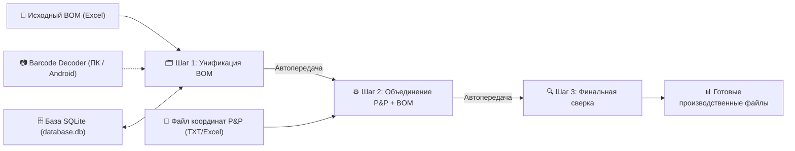
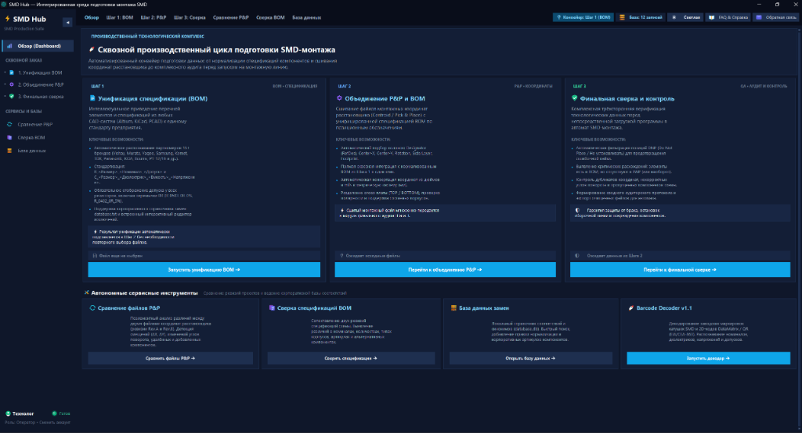

# ⚡ SMD Hub & BarcodeDecoder Suite

Комплексная программная экосистема для автоматизации подготовки поверхностного монтажа (SMD/SMT), унификации спецификаций (BOM), сшивания координат Pick&Place (P&P), верификации заказов и оптического декодирования маркировок радиокомпонентов.

---

## 🌟 Что нового в последней версии

* ☀️ **Поддержка Светлой темы (Clean Light):** полноценный светлый режим для комфортной работы в ярко освещённых производственных цехах и офисах. Также доступны премиальная **Dark Navy (SaaS)** и контрастная **Discord Dark**. Тема применяется сквозным образом ко всем окнам, карточкам, таблицам `Treeview` и системным заголовкам Windows DWM (10/11).
* 🎯 **Интеллектуальный парсинг номиналов (ГОСТ 28883-90 / IEC 60062):** глубокая переработка алгоритма распознавания резисторов. Безошибочная обработка обозначений со встроенными буквенными множителями (`4к7` / `4k7` $\rightarrow$ `4.7K`, `4R7` $\rightarrow$ `4.7R`, `0R22` / `R22` $\rightarrow$ `0.22R`, `1м5` $\rightarrow$ `1.5M`), суффиксами (`100Ом` $\rightarrow$ `100R`, `4.7кОм` $\rightarrow$ `4.7K`), джамперами (`0`, `0R`, `0000` $\rightarrow$ `0R`) и автомасштабированием без потери дробной части.
* ⚡ **Оптимизация производительности и SQLite ядро:**
  * База соответствий переведена на SQLite с режимом журналирования WAL и гарантированным освобождением дескрипторов файлов через контекстные менеджеры (устранена ошибка блокировки файлов `[WinError 32]` на Windows).
  * Пакетная вставка записей в единой транзакции ускорила импорт и миграцию больших списков в **100+ раз**.
  * Устранено дублирование кода: удалено свыше 280 строк избыточных классов, а ядро унификации централизовано в `smd_engine.py`.
  * Изолирована обработка колеса мыши: ликвидированы конфликты глобального скролла, прокрутка работает плавно и контекстно.
* 📖 **Чистота кода и русскоязычные комментарии:** 100% кодовой базы снабжено подробными комментариями на русском языке, типизацией (Type Hints) и docstring-описаниями модулей, классов и алгоритмов. Полное соответствие стандартам качества (0 предупреждений `flake8`).

---

## 📦 Релизные файлы (Скачать)

| Платформа / Приложение | Файл релиза (Прямая загрузка) | Описание |
|---|---|---|
| 🖥️ **Windows (Всё в одном)** | **[💾 Скачать SMD_Hub.exe (v1.2 Portable)](https://github.com/kean5782-coder/PnP_manager/raw/main/BarcodeDecoder/dist/SMD_Hub.exe)** | Единый лаунчер и мастер производства: Унификация BOM, Объединение P&P, Сверка, База данных и Сканер. **Работает автономно, без Python**. |
| 🖥️ **Windows (Сканер)** | **[💾 Скачать BarcodeDecoder.exe (v1.2 Portable)](https://github.com/kean5782-coder/PnP_manager/raw/main/BarcodeDecoder/dist/BarcodeDecoder.exe)** | Автономный сканер и декодер штрихкодов катушек для ПК с обновленным парсером ГОСТ. |
| 📱 **Android** | **[📲 Скачать BarcodeDecoder.apk](https://github.com/kean5782-coder/PnP_manager/raw/main/BarcodeDecoder/dist/BarcodeDecoderForSmdResistorsAndCondensators_kean5782.apk)** | Релизный подписанный APK для мобильного сканирования камерой смартфона. |
| 🛍️ **RuStore** | **[🛍️ Страница в RuStore](https://www.rustore.ru/catalog/app/com.barcodedecoder)** | Официальный релиз в магазине приложений. |

---

## 🚀 Архитектура и возможности экосистемы



---

### 1. ⚡ SMD Hub — Главный рабочий лаунчер

Лаунчер объединяет весь цикл подготовки файлов заказа в пошаговый интерфейс со сквозной передачей данных:



* **Шаг 1: 🗂️ Унификация BOM**
  * **По описанию (русские параметры):** автоматическое определение типов, номиналов, напряжений, диэлектриков и погрешностей из текстовых описаний.
  * **По коду производителя:** распознавание заводских партномеров (Samsung, Murata, Yageo, Vishay, Panasonic, Bourns, Kemet, TDK, Р1-12, Р1-16 и др.).
  * Автоматическое сохранение и мгновенная подстановка обработанного файла в Шаг 2.
* **Шаг 2: ⚙️ Объединение P&P + BOM**
  * Сшивание монтажных координат (X, Y, Rotation, Side, Layer) с унифицированными наименованиями компонентов.
  * Автоматический подбор и сопоставление столбцов (Designator / Ref, Part Name, Layer).
  * Настраиваемые разделители (запятая, пробел, табуляция, точка с запятой, пользовательский).
* **Шаг 3: 🔍 Финальная сверка и контроль качества**
  * Интеллектуальный учет DNP (Do Not Place) и исключений.
  * Выявление нестыковок и пустых позиций.
  * Сводная статистика по верхнему (TOP) и нижнему (BOTTOM) слоям, количеству уникальных номиналов и общему числу компонентов.

---

### 2. 🛠️ Дополнительные сервисы и базы данных

* 🔄 **Сравнение P&P версий:** попозиционное сопоставление двух ревизий файла координат (добавленные, удаленные, смещенные или измененные компоненты).
* 🔄 **Сверка спецификаций BOM:** детальное сравнение старой и новой ревизии BOM-файлов.
* 🗄️ **Высокопроизводительная база данных (`database.db`):**
  * Хранение пользовательских соответствий на базе надежной SQLite с поддержкой многопоточности и WAL-журнала.
  * Метаданные для каждой записи: категория компонента, подробный комментарий на русском языке, автор изменения и точная дата создания.
  * Автоматическая миграция из старого `database.txt` при первом старте без потери данных.
  * Пакетный импорт и экспорт (TXT/Excel) с интерактивным разрешением конфликтов.
* 📷 **Встроенный Barcode Decoder v1.1:** моментальный запуск сканера штрихкодов катушек прямо с главного экрана.

---

### 3. 🎨 Дизайн и эргономика интерфейса

* **Три темы оформления на выбор:**
  * ☀️ **Clean Light:** светлая тема с выверенным контрастом для работы при ярком освещении.
  * 🌌 **Dark Navy (SaaS):** глубокая индиго-палитра с мягкими акцентами.
  * 🌙 **Discord Dark:** контрастная тёмная тема (`#313338`, `#2b2d31`, `#1e1f22`, Blurple `#5865f2`).
* **Контекстный скроллинг мыши:** интеллектуальная прокрутка рабочих областей без перехвата событий у других элементов; автоматическая фокусировка на таблицах `Treeview` и текстовых полях.
* **Нативная стилизация Windows DWM:** синхронизация тёмных/светлых системных заголовков операционной системы.
* **Информативная подсветка:** четкие статусные бейджи готовности файлов, чередование строк в таблицах предпросмотра и цветные векторные иконки.

---

### 4. 📱 Мобильное приложение BarcodeDecoder (Android)

* **CameraX + Google ML Kit:** высокоскоростное поточное сканирование штрихкодов и Data Matrix кодов с катушек компонентов.
* **Интерактивный выбор (Tap-to-Select):** подсветка найденных кодов рамками в реальном времени с выбором касанием.
* **Полная оффлайн-база правил:** единый алгоритм декодирования с десктопной версией.
* **Фонарик, история распознаваний, быстрый поиск даташитов в браузере.**
* **Поддержка портретной и альбомной ориентации.**

---

## 🏭 Поддерживаемые производители радиокомпонентов

| Тип | Производители / Серии |
|---|---|
| **Резисторы** | Vishay (CRCW), Panasonic (ERJ), Bourns (CR/CRA/CMP), KOA Speer (RK73), Royal Ohm, ROHM (MCR/ESR/PMR), Viking (CR), Yageo (RC), Samsung (RC), Walsin (WR), HOTTECH (RI), **Россия (Р1-12, Р1-16 ГОСТ)** |
| **Конденсаторы** | Murata (GRM/GCM/GQM/GCJ...), Samsung (CL), TDK (C/CGA), KEMET (C-series), Taiyo Yuden, AVX / Kyocera AVX, Walsin, Yageo (CC), CCTC (TCC) |

---

## 🛠️ Сборка из исходников

### Сборка Windows `.exe`:
```powershell
# Запуск готового пакетного скрипта сборки всех модулей экосистемы:
.\build_all_exe.bat
```
Или сборка через PyInstaller вручную:
```powershell
py -3.14 -m PyInstaller SMD_Hub.spec
py -3.14 -m PyInstaller BarcodeDecoder.spec
```

### Сборка Android `.apk`:
```powershell
cd AndroidApp
.\gradlew.bat assembleRelease
```
Файл APK будет создан в каталоге `AndroidApp/app/build/outputs/apk/release/`.
