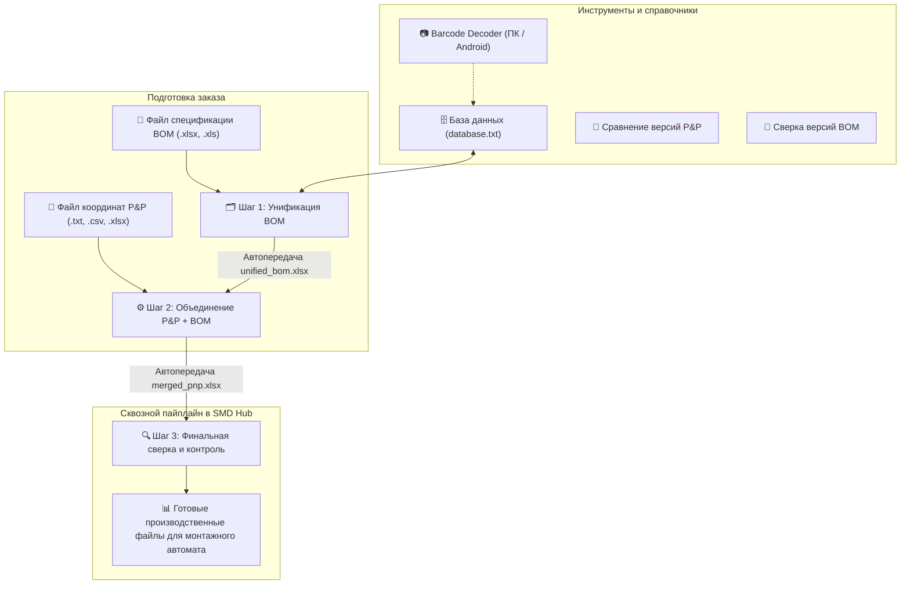

# ⚡ PnP_manager & SMD Hub Suite

**PnP_manager** — комплексная экосистема программного обеспечения для автоматизации процессов поверхностного монтажа печатных плат (SMD/SMT), сквозной подготовки спецификаций (BOM), объединения монтажных координат Pick&Place (P&P), верификации заказов и оптического декодирования маркировок радиодеталей.

---

## 📥 Готовые релизы (Portable & Mobile)

Все исполняемые файлы собраны в автономном (Portable) формате — работают сразу, без установки Python или сторонних зависимостей:

| Платформа / Модуль | Файл релиза (Прямая загрузка) | Описание |
|---|---|---|
| 🖥️ **Windows (Всё в одном)** | **[💾 Скачать SMD_Hub.exe (v1.0 Portable)](https://github.com/kean5782-coder/PnP_manager/raw/main/BarcodeDecoder/dist/SMD_Hub.exe)** | Главный лаунчер и мастер производства: Унификация BOM, Объединение P&P, Выходная сверка, База данных и Сканер. |
| 🖥️ **Windows (Сканер)** | **[💾 Скачать BarcodeDecoder.exe (v1.1 Portable)](https://github.com/kean5782-coder/PnP_manager/raw/main/BarcodeDecoder/dist/BarcodeDecoder.exe)** | Автономный сканер и декодер штрихкодов катушек для рабочего места оператора. |
| 📱 **Android (Прямой APK)** | **[📲 Скачать BarcodeDecoder.apk](https://github.com/kean5782-coder/PnP_manager/raw/main/BarcodeDecoder/dist/BarcodeDecoderForSmdResistorsAndCondensators_kean5782.apk)** | Релизный подписанный APK для мобильного сканирования камерой смартфона. |
| 🛍️ **RuStore (Каталог)** | **[🛍️ Страница в RuStore](https://www.rustore.ru/catalog/app/com.barcodedecoder)** | Официальная страница мобильного приложения в RuStore. |

---

## 🚀 Сквозной производственный процесс (Workflow)



---

## 📁 Структура репозитория

```text
PnP_manager/
├── BarcodeDecoder/                       # Основной каталог инструментов
│   ├── smd_hub.py                        # ⚡ Главный лаунчер и сквозной мастер заказов
│   ├── smd_engine.py                     # 🧠 Единый движок парсинга, стилей и тем оформления
│   ├── BarcodeDecoder_1.1.py             # 📷 Десктопный сканер/декодер штрихкодов катушек
│   │
│   ├── Unification/                      # 🗂️ Модуль унификации BOM
│   │   ├── Unification.py                # Унификация по коду/описанию, редактор подготовки документа
│   │   └── database.txt                  # Пользовательский справочник соответствий
│   │
│   ├── PnP_Manager/                      # ⚙️ Модуль Pick and Place
│   │   └── PnP_Manager.py                # Объединение координат, сверка BOM и версий P&P
│   │
│   ├── AndroidApp/                       # 📱 Нативное Android-приложение
│   │   ├── app/                          # Исходный код (Kotlin, CameraX, Google ML Kit)
│   │   └── release-key.jks               # Ключ подписи релизных сборок
│   │
│   ├── dist/                             # 📦 Скомпилированные исполняемые файлы (.exe, .apk)
│   │   ├── SMD_Hub.exe                   # Полный комбайн для Windows
│   │   ├── BarcodeDecoder.exe            # Автономный сканер для ПК
│   │   └── BarcodeDecoder...apk          # Релизный APK для Android
│   │
│   └── build_all_exe.bat                 # Пакетная пересборка всех EXE файлов
└── README.md                             # Главная документация проекта
```

---

## 🌟 Ключевые возможности

### 1. ⚡ SMD Hub — Главный лаунчер производства
* **Шаг 1: Унификация BOM:**
  * Распознавание партнерских кодов (Samsung, Murata, Yageo, Vishay, Panasonic, Bourns, Kemet, TDK, Р1-12, Р1-16 и др.).
  * Парсинг русских текстовых описаний и номиналов.
  * Кнопка автоматического перехода в Шаг 2 с сохранением и предвыбором колонок.
* **Шаг 2: Объединение P&P + BOM:**
  * Сшивание координат платы с унифицированным списком компонентов.
  * Интеллектуальный автоподбор столбцов (`Designator`, `Part Name`, `Side`, `X`, `Y`, `Rotation`).
  * Конвертация систем единиц (милы $\leftrightarrow$ миллиметры), фильтрация сторон (TOP / BOTTOM).
* **Шаг 3: Финальная сверка и валидация:**
  * Интеллектуальный контроль DNP (Do Not Place) и исключений.
  * Обнаружение пропущенных или лишних позиций, несовпадений номиналов.
  * Сводная статистика и экспорт отчетов.

### 2. 🛠️ Дополнительные сервисы
* 🔄 **Сравнение версий P&P:** сопоставление ревизий расстановки с выявлением смещений, замен и удалений.
* 🔄 **Сверка спецификаций BOM:** табличное сравнение двух версий перечня элементов.
* 🗄️ **Управление базой соответствий (`database.txt`):**
  * Интерактивное окно **«Подготовка документа»** с полноэкранной таблицей.
  * Выбор ключевого столбца (BOM) и пользовательского названия прямо в окне предпросмотра с **разноцветной подсветкой** колонок.
  * Автономное сохранение базы рядом с `.exe` в Portable-режиме.
* 📷 **Barcode Decoder:** встроенный и автономный оптический сканер.

### 3. 🎨 Дизайн и эргономика
* 🌙 **Тёмная тема (Discord Dark):** глубокая контрастная палитра (`#313338`, `#2b2d31`, `#1e1f22`, Blurple `#5865f2`).
* ☀️ **Светлая тема (Clean Light):** приятная светлая тема для ярко освещенных участков.
* 🖱️ **Сквозная умная прокрутка (MouseWheel):** колесико мыши прокручивает страницу везде, где находится курсор, переключаясь на списки и таблицы при наведении на них.
* 🪟 **DWM Dark Mode:** темные системные заголовки окон Windows 10/11 во всех диалогах.
* 📊 **Полосатые таблицы:** чередование строк в предпросмотрах для снижения утомляемости глаз.

---

## 🏭 Поддерживаемые производители радиокомпонентов

| Тип компонента | Производители и поддерживаемые серии |
|---|---|
| **Резисторы** | Vishay (CRCW), Panasonic (ERJ), Bourns (CR/CRA/CMP), KOA Speer (RK73), Royal Ohm, ROHM (MCR/ESR/PMR), Viking (CR), Yageo (RC), Samsung (RC), Walsin (WR), HOTTECH (RI), **Россия (Р1-12, Р1-16)** |
| **Конденсаторы (MLCC)** | Murata (GRM/GCM/GQM/GCJ...), Samsung (CL), TDK (C/CGA), KEMET (C-series), Taiyo Yuden, AVX / Kyocera AVX, Walsin, Yageo (CC), CCTC (TCC) |

---

## 🛠️ Сборка из исходного кода

### Запуск в среде Python:
```powershell
# Установка зависимостей:
pip install pandas openpyxl numpy

# Запуск единого лаунчера:
python BarcodeDecoder/smd_hub.py
```

### Сборка автономных Windows EXE:
```powershell
cd BarcodeDecoder
.\build_all_exe.bat
```

### Сборка Android APK:
```powershell
cd BarcodeDecoder/AndroidApp
set JAVA_HOME=C:\Program Files\Android\Android Studio\jbr
.\gradlew.bat assembleRelease
```
Готовый подписанный APK будет создан в папке `BarcodeDecoder/AndroidApp/app/build/outputs/apk/release/`.

---

## 📜 Лицензия
Проект распространяется под лицензией MIT. Подробнее см. файл [LICENSE](LICENSE).
